# 🛍️ E-commerce Flutter App

A scalable E-commerce mobile application built with Flutter, following **Clean Architecture** and **Test-Driven Development (TDD)**, using **DummyJSON APIs**.  
The app focuses on maintainability, performance, and clean separation of concerns while demonstrating production-level API handling.

---

## 🚀 Features

- Product listing with pagination
- Category-based browsing
- Debounced product search
- Product detail view
- Token-based authentication with auto-refresh
- API caching for improved performance
- Declarative navigation using GoRouter

---

## 🧠 Tech Stack

- Flutter
- Riverpod
- Dio
- GoRouter
- Freezed
- Mocktail

## Screenshots

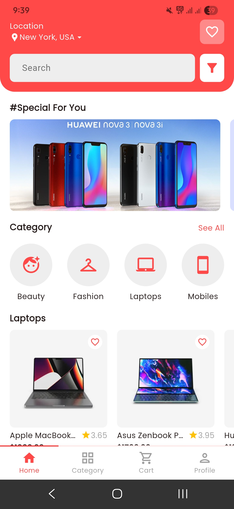 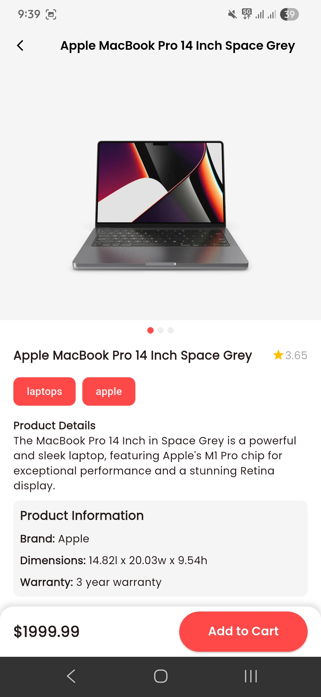 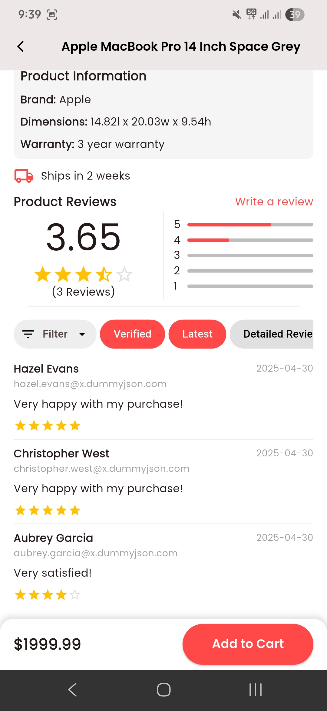   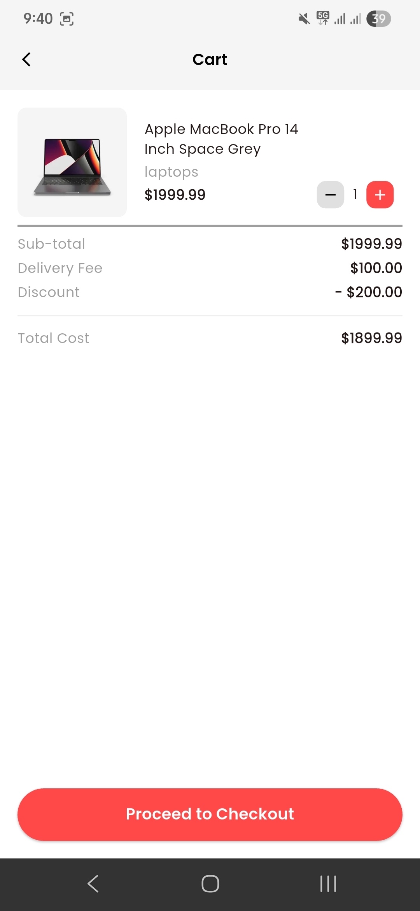 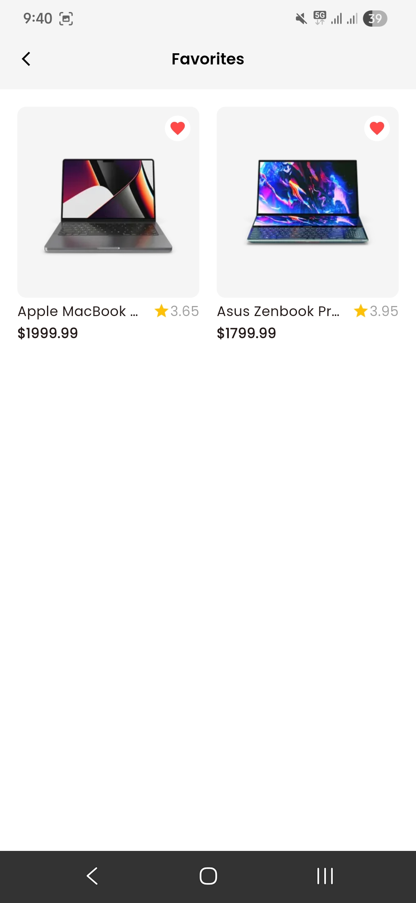 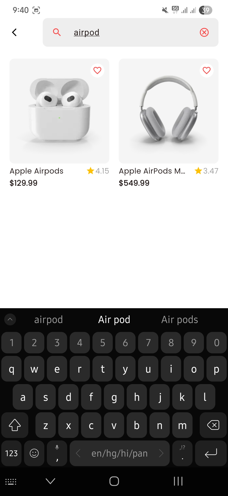 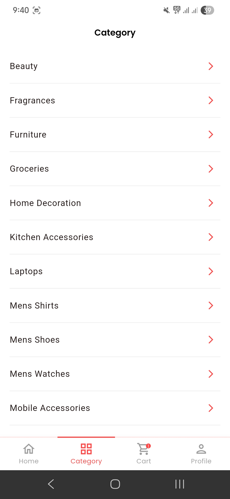 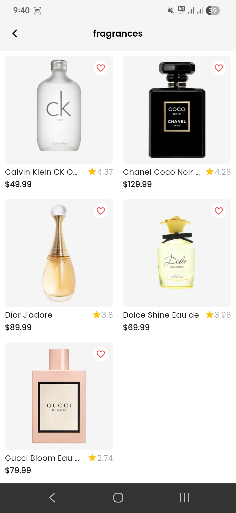 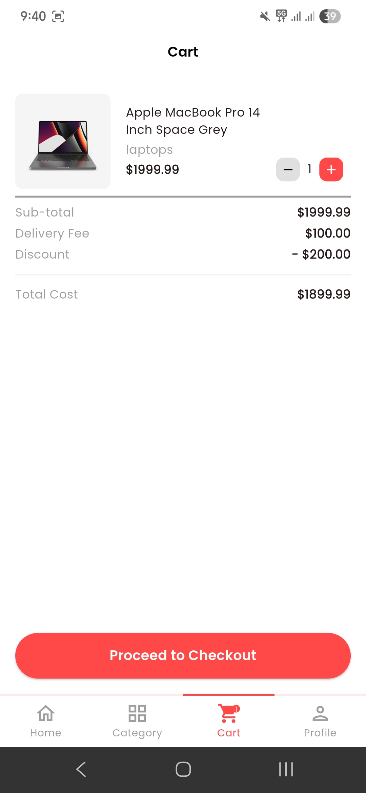   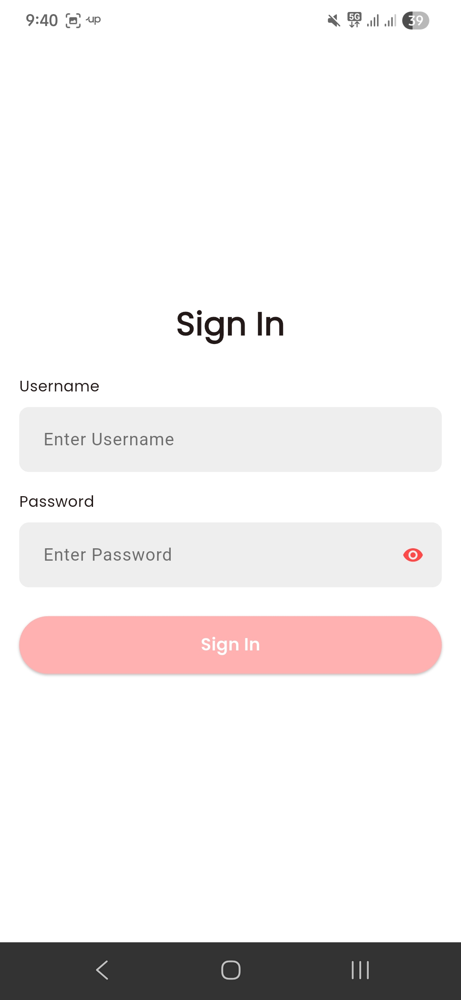 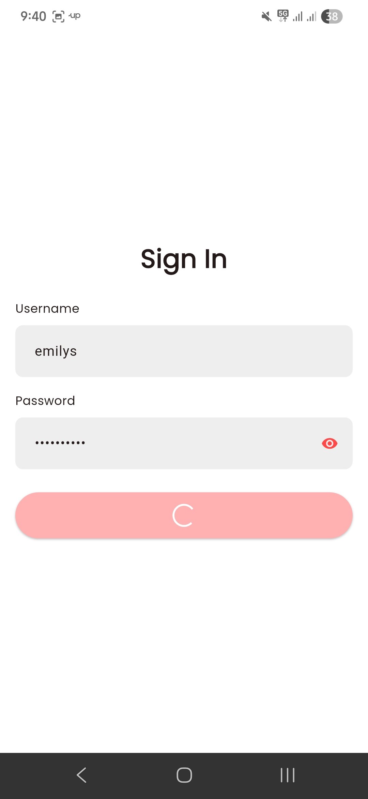 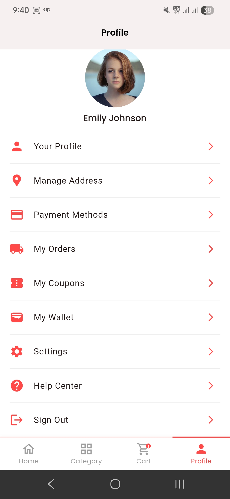
